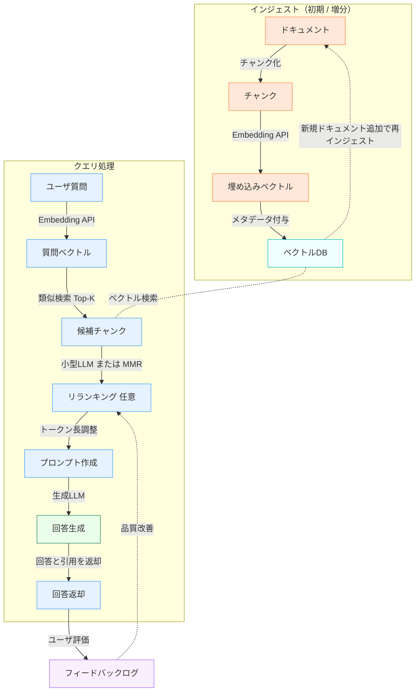
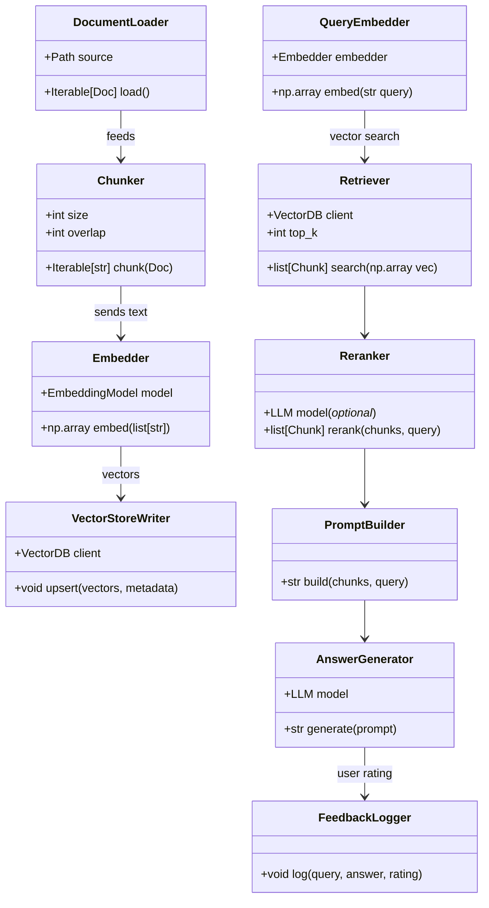
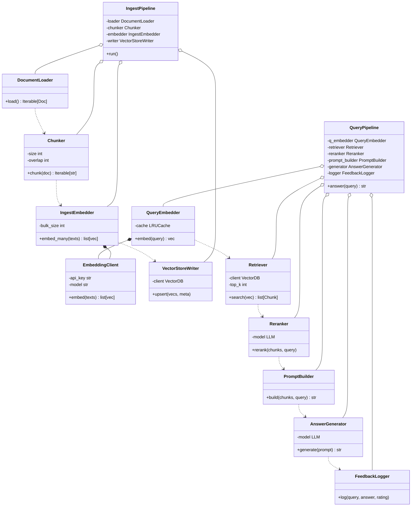
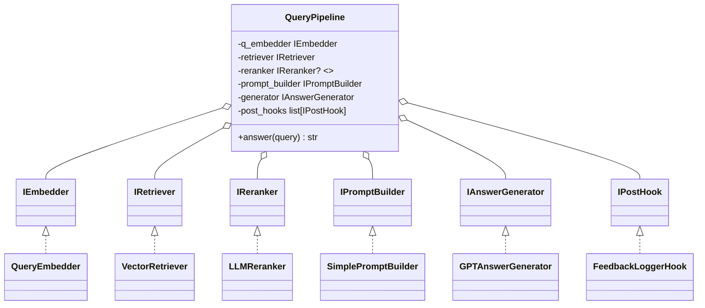
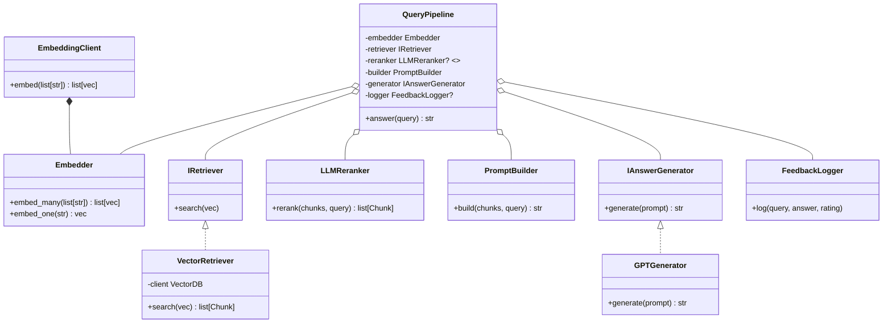
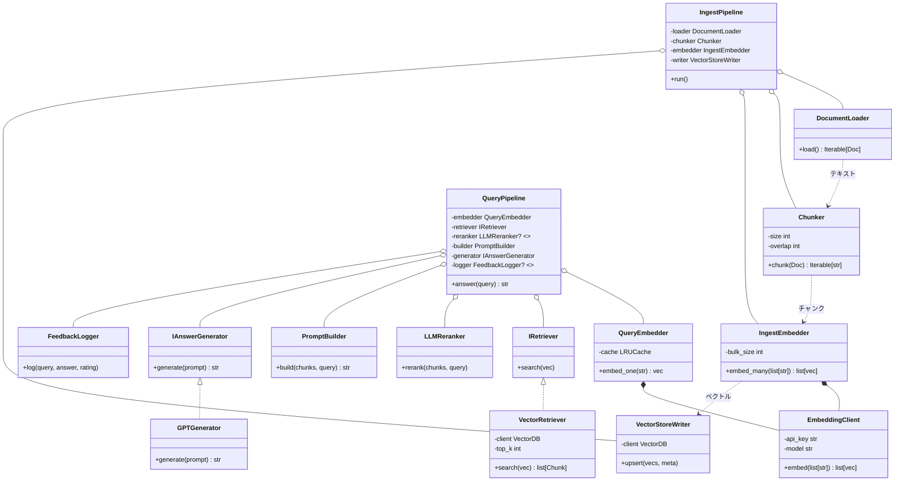
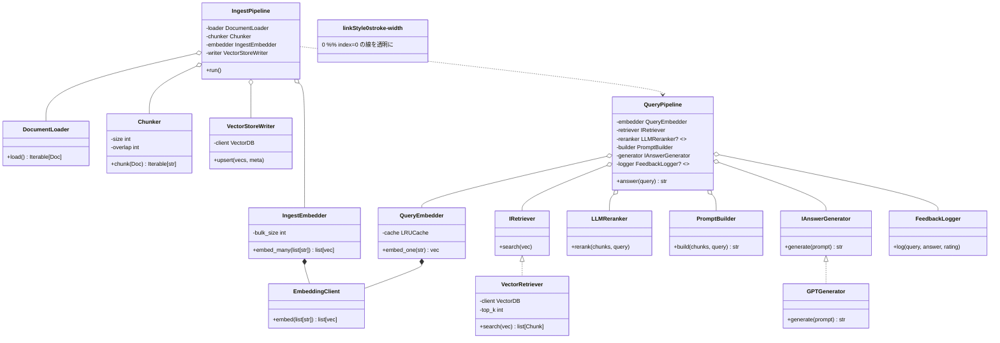
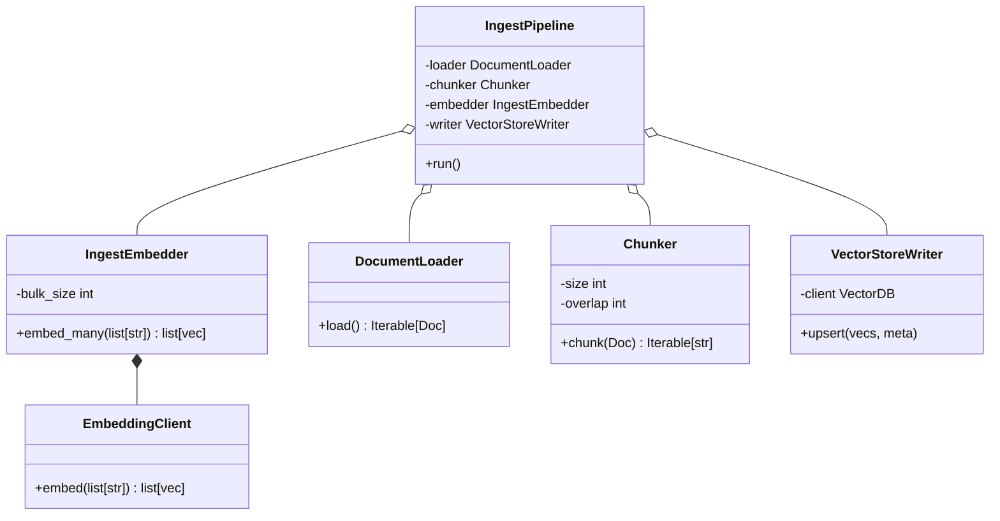
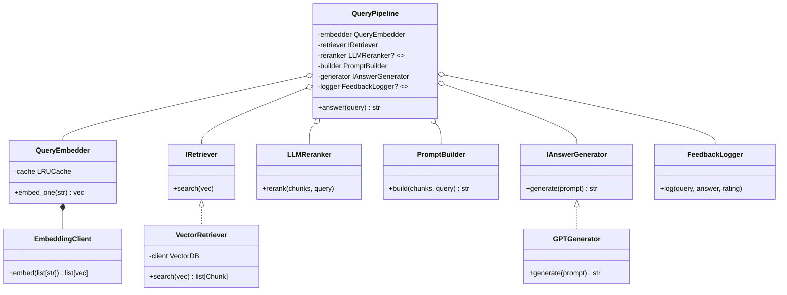

# RAGの構築クラスイメージ

Phase2まで作成してDBのない状態である程度適切なクラス構成を作成できた。
実際にはキャッシュではなくDB化したりするので、このあたりを考慮したより実用的なRAG構成を記載する。

7/5時点では実装していないので、あくまでイメージである。

## 1. DBを含めたRAGのイメージ

## 2. クラスとして機能を分割してみる

### 一番荒い初期のイメージ

クラス間の依存

### クラス化

### 2.1. 依存が深い部分を改善する

あまりにも安直すぎたので、ちょっと修正
↓

EmbedderとRetriverの依存関係切るのはやりすぎという印象もある。ただ、RetriverとEmbedderが別れるほうが構造としてはきれいではある。

### 2.2. 依存を残した状態での図

## 3. 最終形態

### 3.1. IngestPipeline

EmbeddingClientは共通

### 3.2. QueryPipeline

EmbeddingClientは共通

